# Let's Raise the *Roof!* Predicting the Energy of House Music.  
#### A predictive study on the energy of music - a measure of intensity and activity

#### Table of Contents

<details>
  <summary>Table of Contents</summary>
- [Let's Raise the *Roof!* Predicting the Energy of House Music.](#lets-raise-the-roof-predicting-the-energy-of-house-music)
      - [A predictive study on the energy of music - a measure of intensity and activity](#a-predictive-study-on-the-energy-of-music---a-measure-of-intensity-and-activity)
      - [Table of Contents](#table-of-contents)
  - [Introduction](#introduction)
  - [Attributes](#attributes)
  - [Data Pre-processing](#data-pre-processing)
    - [Required Libraries](#required-libraries)
    - [Gathering the Data](#gathering-the-data)
    - [Reading and Cleaning the Data](#reading-and-cleaning-the-data)
  - [Multicollinearity Assessment](#multicollinearity-assessment)
  - [KNN Regression](#knn-regression)
    - [Feature Selection](#feature-selection)
    - [K-Neighbors Grid Search](#k-neighbors-grid-search)
  - [Residuals Analysis](#residuals-analysis)
  - [Discussion](#discussion)
  - [References](#references)
</details>

## Introduction

Spotify is one of the largest music streaming services with over [406 million users](https://www.google.com/url?q=https://newsroom.spotify.com/company-info/&sa=D&source=docs&ust=1646548657733947&usg=AOvVaw2-aNiFTZDrkhXIWRxPE4aU) amounting to [75 million monthly listeners](https://dl.acm.org/doi/10.1145/2959100.2959120). The success of Spotify can be attributed towards the collection of user data, which allows for the curation of personalized playlists and recommended songs. Spotify has created a web API for public use, which grants users the ability to view information about artists and their songs. Amongst these functions, audio features can be gathered from songs, revealing several measures of their melody and lyrics. For this exploration, the focus will be on songs from the [house music genre](https://www.allmusic.com/subgenre/house-ma0000002651?1646545415388&fbclid=IwAR2ZKQ2EAzLFX4E4FsCyNbLL17Y2Jrjmtqz0tW7dsIwkIn40YQT2QV1hYH8), which is a type of electronic dance music characterized by high energy, repeated beats, and synthesized sounds. The purpose of this study is to answer the following question:  

Given the audio features of songs such as acousticness, danceability, liveness, loudness, speechiness, tempo, and valence, how can we predict the energy rating?

For the dataset, the [Spotify web API](https://developer.spotify.com/documentation/web-api/reference/#/operations/get-several-audio-features) will be used to collect audio features for all the songs of the top 10 artists in the house music genre (Tiesto, Mashmello, Calvin Harris, The Chainsmokers, Alan Walker, Kygo, Diplo, Daft Punk, Martin Garrix, and Zedd). Collecting the audio features of their tracks provides several song metrics, of which the following will be used.

## Attributes
    
* `acousticness` - A measure from 0.0 to 1.0 of how natural a track is (not having synthetic or electric amplification)  
* `danceability` - A measure from 0.0 to 1.0 of how suitable a track is for dancing, based on tempo, rhythm stability, beat strength, and regularity  
* `energy` - A measure from 0.0 to 1.0 of intensity, activity, and energy  
* `liveness` - A measure from 0.0 to 1.0 representing the probability of the presence of an audience  
* `loudness` - The average volume of a track in decibels (dB)  
* `speechiness` - A measure from 0.0 to 1.0 of the presence of spoken words  
* `tempo` - The overall estimated speed of the track in beats per minute (BPM)  
* `valence` - A measure from 0.0 to 1.0 denoting the positiveness conveyed by the track

## Data Pre-processing
### Required Libraries

<details>
  <summary>Importing required libraries</summary>

  ```R
# loading required libraries
library(spotifyr)
library(tidyverse)
library(tidymodels)
library(dplyr)
library(infer)
library(ggplot2)
library(GGally)
library(cowplot)
library(car)
  ```
</details>

### Gathering the Data
Spotify's Web API is used to access the data on music. For this study, data will be gathered from the top 10 artists of the House Music genre. The data is then uploaded to the cloud for ease of access.

<details>
  <summary>Click to see code</summary>
  
  ```R
# accessing the Spotify API
Sys.setenv(SPOTIFY_CLIENT_ID = "********************************")
Sys.setenv(SPOTIFY_CLIENT_SECRET = "********************************")
access_token <- get_spotify_access_token()

# list of top artists of genre: house
top_artists <- get_genre_artists("house") %>%
    arrange(desc(popularity))

# converting id column from dataframe into vector
id_list <- as.vector(top_artists[[3]], mode = "character")

# initiating dataframe accumulator
# Travis Scott is NOT a house artist
raw <- get_artist_audio_features(id_list[2])

# looping over top 10 artists of genre to accumulate data
i <- 3
while (i < 12) {
  temp <- get_artist_audio_features(id_list[i])
  raw <- rbind(raw, temp)
  i <- i + 1
}

# writing to local and uploading to cloud
write_csv(raw, "data/top_10_house_artists_data.csv")
  ```
</details>

### Reading and Cleaning the Data
The data is now read from the cloud.

<details>
  <summary>Click to see code</summary>

  ```R
# reading from cloud and previewing the data
house_raw <- read_csv("https://drive.google.com/uc?id=1B5C4YbVU0cFlrbUWhir9lqwxbwYBlou_&export=download", show_col_types = FALSE) #nolint
head(house_raw)
paste("Raw data rows:", nrow(house_raw))
paste("Raw data columns:", ncol(house_raw))
  ```
</details>

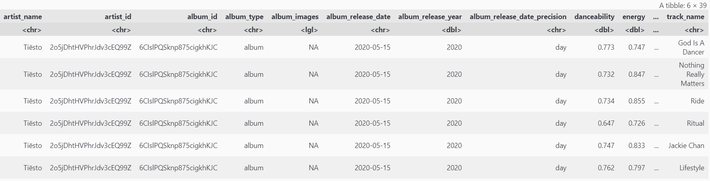

Table 1: Raw training data from the cloud.

In this dataset, there are 3023 rows, each representing a different track. There are 39 columns, with artist details (such as name, album, urls, dates), and audio features (such as energy, loudness, tempo). For this exploration, only specific audio features with continuous data is going to be examined.  
  
Thus, the next step is to clean and wrangle the dataset. It should be noted that there is a high likelihood that there are duplicate rows, where tracks were reuploaded under different names. This may be due to covers, features, or differences between singles and album songs.

<details>
  <summary>Click to see code</summary>

  ```R
# selecting only the important audio features
house_raw_selected <- house_raw  %>%
    dplyr::select(acousticness,
           danceability,
           liveness,
           loudness,
           speechiness,
           tempo,
           valence,
           energy)

# removing duplicate rows and any NA rows
house_raw_unique <- house_raw_selected[!duplicated(house_raw_selected), ] %>%
    na.omit()

# showing tidy data
house_tidy <- house_raw_unique
head(house_tidy)
paste("Tidy data rows:", nrow(house_tidy))
  ```
</details>

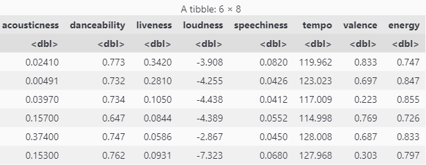

Table 2: Tidy data from the dataset, including audio features of acousticness, danceability, energy, liveness, loudness, speechiness, tempo, and valence. There are now a total of 2404 rows, each of them now representing a unique track.
  
Before proceeding to create the regression model, the dataset will be split into training data and testing data. To improve the external validity of the data, it will be randomly sampled from the gathered tracks in the dataset.

<details>
  <summary>Click to see code</summary>

  ```R
# setting seed for reproducible results
set.seed(604)

# creating 50/50 split
house_initial_split <- initial_split(house_tidy, prop = 0.5)
house_train <- training(house_initial_split)
house_test <- testing(house_initial_split)

# previewing training data
head(house_train)
paste("Training data rows:", nrow(house_train))

# previewing testing data
head(house_test)
paste("Testing data rows:", nrow(house_test))
  ```
</details>

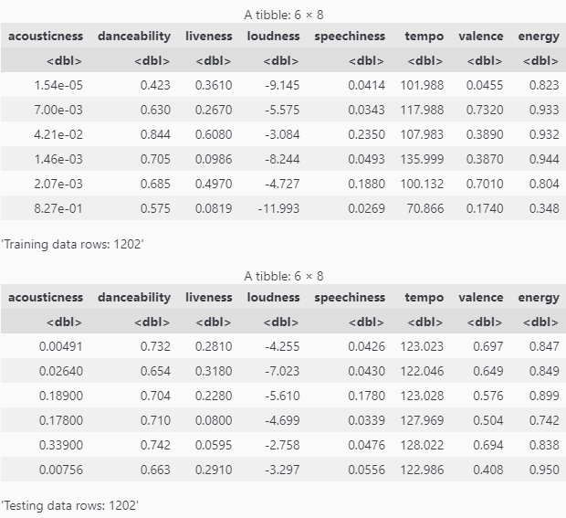

Table 3.1 (Above): Tidy training data, with 1202 rows, each representing a unique track.  
Table 3.2 (Below): Tidy testing data, with 1202 rows, each representing a unique track.  

## Multicollinearity Assessment

Next, the data will be visualized with a scatterplot matrix, where multicollinearity as well as response variable correlation can be assessed. Predictor variables with strong inter-correlations indicate collinearity, which should be avoided to mitigate predictive amplification. Predictor variables with strong correlations to the response variable should be prioritized, as they can be used to build a stronger predictive model.

<details>
  <summary>Click to see code</summary>

  ```R
# creating paired matrix plot
house_paired <- house_train %>%
    ggpairs()

# visualizing paired plot
options(repr.plot.width = 12, repr.plot.height = 12)
house_paired
  ```
</details>

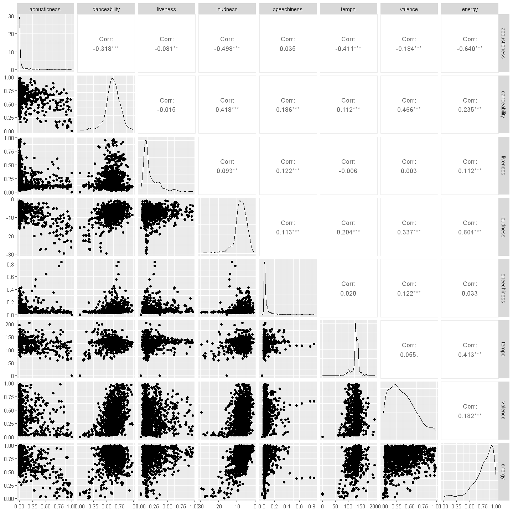

Figure 1: Scatterplot matrix of audio features with their Pearson correlation coefficients. The audio features included are acousticness, danceability, liveness, loudness, speechiness, tempo, valence, and energy.  

The correlations between predictor variables range between absolute values of 0.015 to 0.498. To assess multicollinearity, the [variance inflation factor (VIF)](https://link.springer.com/chapter/10.1007/978-0-585-25657-3_37?fbclid=IwAR2u0Vn5r5yuJu6xJ0Pf7pKe3lHKhDeiLuY-3SnAUnkXkBjzuhZju9PLvtY) can be used, which quantifies how much variance is inflated for each predictor variable. Variables with high VIF measurements suggest that existing correlations amongst predictor variables are skewing the results. This may lead to overfitting of the model, with unstable and inflated outputs. For this study, a conservative VIF threshold of 2.5 will be used to indicate significant multicollinearity.  

Variance inflation factors can be visualized below.

<details>
  <summary>Click to see code</summary>

  ```R
# creating linear regression model
lm_model <- lm(energy ~ ., data = house_train)

# creating dataframe of VIF values
vif_vals <- as.vector(vif(lm_model))
vif_labs <- as.vector(colnames(house_train))[1:7]
vif_df <- data.frame(vif_labs, vif_vals)

# creating VIF plot
vif_plot <- vif_df %>%
    ggplot(aes(x = vif_labs, y = vif_vals)) +
    geom_bar(stat = "identity") +
    geom_hline(yintercept = 2.5, colour = "red") +
    scale_y_continuous(breaks = 1:8, limit = c(0, 8)) +
    labs(title = "Variance Inflation Factors of Predictor Variables",
         x = "Predictor Variable",
         y = "Variance Inflation Factor (VIF)") +
    coord_flip() +
    theme(plot.title = element_text(hjust = 0.5, size = 30),
          text = element_text(size = 20))

# visualizing VIF plot
options(repr.plot.width = 16, repr.plot.height = 7)
vif_plot
  ```
</details>

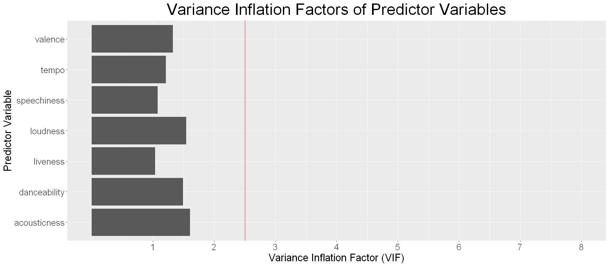

Figure 2: Variance Inflation Factor of Predictor Variables. VIF threshold is set at 2.5. Predictor variables include acousticness, danceability, liveness, loudness, speechiness, tempo, and valence.  

It appears that all predictor variables are well below the threshold for multicollinearity, suggesting that using multiple predictors will not lead to significant output inflation or skewing.

On the contrary, the 3 predictor variables with the strongest correlations to energy are acousticness (-0.640), loudness (0.604), and tempo (0.413). They can be visualized individually below.

<details>
  <summary>Click to see code</summary>

  ```R
# acousticness vs energy
a <- ggplot(house_train, aes(x = acousticness, y = energy)) +
    geom_point(aes(alpha = 0.5)) +
    stat_smooth(method = "lm", col = "red") +
    labs(title = "Acousticness vs Energy of House Music\n(r = -0.640)",
         x = "Acousticness",
         y = "Energy") +
    theme(plot.title = element_text(hjust = 0.5, size = 20),
          text = element_text(size = 15),
          legend.position = "none")

# loudness vs energy
b <- ggplot(house_train, aes(x = loudness, y = energy)) +
    geom_point(aes(alpha = 0.5)) +
    stat_smooth(method = "lm", col = "red") +
    labs(title = "Loudness vs Energy of House Music\n(r = 0.604)",
         x = "Loudness (dB)",
         y = "Energy") +
    theme(plot.title = element_text(hjust = 0.5, size = 20),
          text = element_text(size = 15),
          legend.position = "none")
    
# tempo vs energy
c <- ggplot(house_train, aes(x = tempo, y = energy)) +
    geom_point(aes(alpha = 0.5)) +
    stat_smooth(method = "lm", col = "red") +
    labs(title = "Tempo vs Energy of House Music\n(r = 0.413)",
         x = "Tempo (BPM)",
         y = "Energy") +
    theme(plot.title = element_text(hjust = 0.5, size = 20),
          text = element_text(size = 15),
          legend.position = "none")

# visualizing them side by side
options(repr.plot.width = 27, repr.plot.height = 9)
plot_grid(a, b, c, nrow = 1, ncol = 3) %>%
    suppressMessages()
  ```
</details>

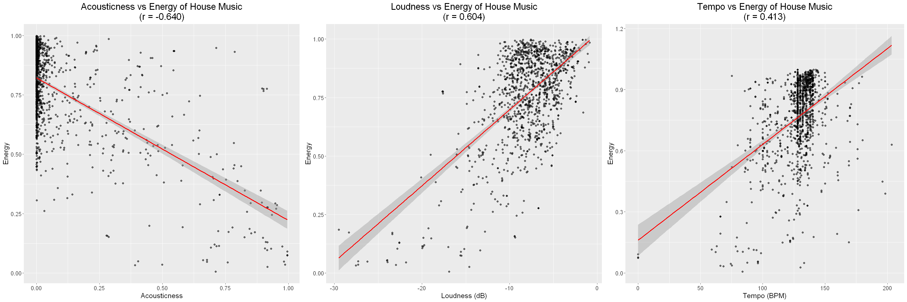

Figure 3.1 (Left): Acousticness vs Energy of House Music  
Figure 3.2 (Middle): Loudness vs Energy of House Music  
Figure 3.3 (Right): Tempo vs Energy of House Music  
  
Upon closer examination of the data, it is evident that the data is not well fitted for a linear regression. Despite having moderate correlations with energy, all 3 plots have a curved and irregular trending of points, with denser regions that show near-vertical trends. In such cases, transformations could be applied to the data in order to achieve linearity. However, for this study, the K-Nearest Neighbors regression method will be used instead.  

## KNN Regression

The KNN regression is a predictive method that approximates the association between predictor variables and the response variable by assessing the closest observations in the same area of the training dataset. The KNN algorithm seeks the closest neighbors based on the Euclidian distance. The advantage to using KNN regression is that it is a simple non-parametric algorithm, which does not make assumptions regarding the distribution of the data. Thus, it will work well with the non-linear distributions seen in this study.  

### Feature Selection

It should be noted that KNN regression will not predict well beyond the range of values from the training data. Furthermore, it does not perform well with large numbers of predictors, and grows slow with large amounts of training data. Therefore, to avoid building an overly complex model, it is important to select an optimal combination of predictor variables.  

Below, variable selection is executed using the forward selection procedure. This procedure attempts to find an optimal subset of predictor variables by inserting them into the model one at a time. At each step, the predictor variable with the highest partial correlation is added to the model, and the k-neighbor hyperparameter is tuned to obtain the lowest root mean squared error (RMSE) value. This tuning occurs using 10-fold cross-validation to mitigate skewing of the data from sampling variation. 

<details>
  <summary>Click to see code</summary>

  ```R
# setting seed for reproducible results
set.seed(604)

# creating vector of predictor variable names
names <- house_train %>%
  dplyr::select(-energy) %>%
  colnames()

# creating empty tibble to store the results
selection_result <- tibble(size = integer(),
                     model_string = character(),
                     rmse = numeric())

# creating knn model specification
knn_spec <- nearest_neighbor(weight_func = "rectangular",
                             neighbors = tune()) %>%
     set_engine("kknn") %>%
     set_mode("regression")

# creating 10-fold cross-validation object
house_vfold <- vfold_cv(house_train, v = 10, strata = energy)

# creating k-neighbors trial range
k_vals <- tibble(neighbors = seq(from = 1, to = 100, by = 2))

# creating object to store total number of predictor variables
n_total <- length(names)

# creating vector to store selected predictors
selected <- c()

# for every size from 1 to the total number of predictors
for (i in 1:n_total) {
    # creating accuracy list object
    rmse_list <- list()
    # creating models_list list object
    models_list <- list()

    # for every predictor not yet added
    for (j in 1:length(names)) {
        # create a model string for this combination of predictors
        new_predictors <- c(selected, names[[j]])
        model_string <- paste("energy", "~",
                              paste(new_predictors, collapse = " + "))

        # create a recipe from the model string
        house_recipe <- recipe(as.formula(model_string),
                               data = house_train) %>%
                          step_scale(all_predictors()) %>%
                          step_center(all_predictors())

        # tune the KNN classifier with these predictors,
        # and collect the rmse for the best K
        rmse <- workflow() %>%
          add_recipe(house_recipe) %>%
          add_model(knn_spec) %>%
          tune_grid(resamples = house_vfold, grid = k_vals) %>%
          collect_metrics() %>%
          # filtering for rmse results
          filter(.metric == "rmse") %>%
          # filter for row with lowest rmse result
          filter(mean == min(mean))

        # storing rmse
        rmse <- rmse$mean

        # add this result to the dataframe
        rmse_list[[j]] <- rmse
        models_list[[j]] <- model_string
    }
    # index of minimum rmse
    jstar <- which.min(unlist(rmse_list))

    # storing new rmse entry
    selection_result <- selection_result %>%
      add_row(size = i,
              model_string = models_list[[jstar]],
              rmse = rmse_list[[jstar]])

    # selecting next predictor variable
    selected <- c(selected, names[[jstar]])
    # removing from worklist
    names <- names[-jstar]
}
selection_result
  ```
</details>

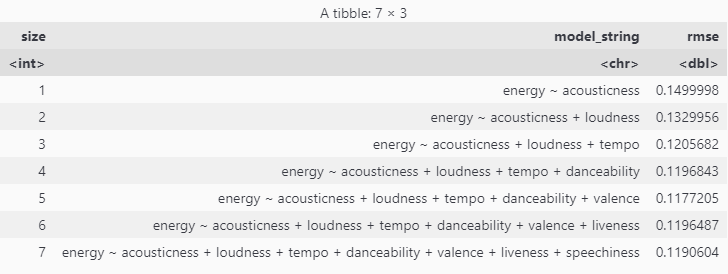

Table 4: Root mean squared error (RMSE) results of forward selection. This table shows the lowest RMSE values obtained for each combination of predictor variables iterated through forward selection. Since there are a total of 7 predictor variables, forward selection has outputted 7 different combinations.  

The results of this table can be visualized below.

<details>
  <summary>Click to see code</summary>

  ```R
# creating plot of rmse vs number of predictors from forward selection results
selection_result_plot <- selection_result %>%
    ggplot(aes(x = size, y = rmse)) +
    geom_line() +
    geom_point() +
    scale_x_continuous(breaks = 1:7) +
    labs(title = "Number of Predictors vs Estimated RMSE",
         x = "Number of Predictors",
         y = "Estimated RMSE") +
    theme(plot.title = element_text(hjust = 0.5, size = 30),
          text = element_text(size = 20))

# visualizing selection results plot
options(repr.plot.width = 16, repr.plot.height = 7)
selection_result_plot
  ```
</details>

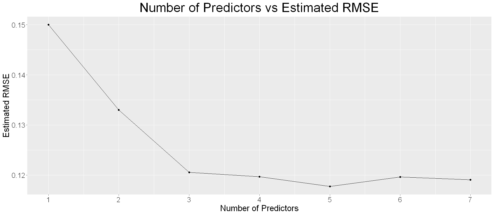

Figure 4: Number of Predictors vs Estimated RMSE.  

According to the plot, the model with 5 predictor variables has the lowest RMSE value. However, it is important to note that the RMSE values will fluctuate due to sampling variation from cross-validation. It is also evident that there are greatly diminishing returns with increasing model predictors past 3 variables. Using too many predictor variables will lead to overfitting and excessive model complexity. While this may appear to fit the training data well with low bias, it will have poor generalizability to new data with higher variance. These two sources of error cannot be simultaneously minimized due to the [bias-variance tradeoff](https://www.ncbi.nlm.nih.gov/pmc/articles/PMC5969114/?fbclid=IwAR2iKztbQH8JVUawh7m36ixXiBHFssk7oljTA5-63IGcvA_OGnGKHOCrcmQ). Thus, it is a better choice to use the simpler model that still has significant decreases in RMSE.

### K-Neighbors Grid Search

For this study, the model with 3 predictors will be chosen, which include acousticness, loudness, and tempo. The tuning will be performed using grid search, which is a method that exhausts all values within a range to determine the optimal k-neighbors hyperparameter value. To avoid tied votes, only odd numbers will be specified. For this model, a range of every odd number between 1-100 will be used for the grid search.

A detailed view of the model tuning can be visualized below.

<details>
  <summary>Click to see code</summary>

  ```R
# setting seed for reproducible results
set.seed(604)

# creating recipe for 3 predictor multivariate knn regression
# using acousticness, loudness, and tempo
knn_recipe <- recipe(energy ~ acousticness + loudness + tempo,
                     data = house_train) %>%
    step_scale(all_predictors()) %>%
    step_center(all_predictors())

# creating knn specification with tuning neighbors
knn_spec <- nearest_neighbor(weight_func = "rectangular",
                             neighbors = tune()) %>%
    set_engine("kknn") %>%
    set_mode("regression")

# creating 10 fold cross validation object
knn_vfold <- vfold_cv(house_train, v = 10, strata = energy)

# creating k-neighbors trial range
k_vals <- tibble(neighbors = seq(from = 1, to = 100, by = 2))

# results of tuning k-neighbors parameter
knn_results <- workflow() %>%
    add_recipe(knn_recipe) %>%
    add_model(knn_spec) %>%
    tune_grid(resamples = knn_vfold, grid = k_vals) %>%
    collect_metrics() %>%
    filter(.metric == "rmse")

# creating plot of tuning results
knn_results_plot <- knn_results %>%
    ggplot(aes(x = neighbors, y = mean)) +
    geom_point() +
    geom_line() +
    scale_x_continuous(breaks = seq(from = 0, to = 100, by = 5)) +
    labs(title = "Neighbors vs RMSE",
         x = "Neighbors",
         y = "RMSE") +
    theme(plot.title = element_text(hjust = 0.5, size = 30),
          text = element_text(size = 20))
    
# visualizing plot
options(repr.plot.width = 16, repr.plot.height = 7)
knn_results_plot

# storing neighbors for lowest rmse
kmin <- knn_results %>%
    filter(mean == min(mean)) %>%
    pull(neighbors)
  ```
</details>

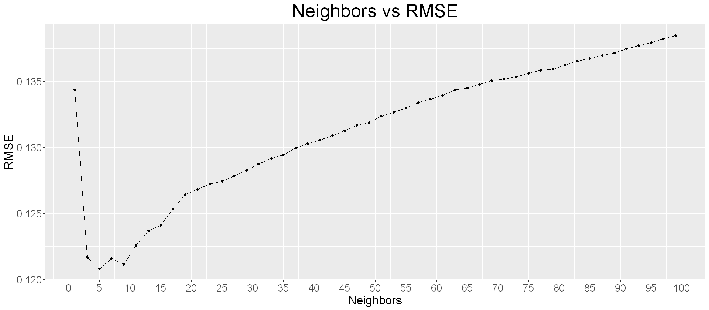

Figure 5: Neighbors vs RMSE, showing the RMSE values associated with the multivariate KNN regression across different values of k-neighbors. The predictor variables being used are acousticness, loudness, and tempo.  

Tuning the model shows that the lowest RMSE value occurs when k = 5 neighbors. As such, the model will be built using k = 5 neighbors, and subsequently tested on the testing dataset.

<details>
  <summary>Click to see code</summary>

  ```R
# adjusting knn specification for lowest rmse neighbor value
knn_spec_actual <- nearest_neighbor(weight_func = "rectangular",
                                    neighbors = kmin) %>%
    set_engine("kknn") %>%
    set_mode("regression")

# adjusting knn fit for new specification
knn_fit <- workflow() %>%
    add_recipe(knn_recipe) %>%
    add_model(knn_spec_actual) %>%
    fit(data = house_train)

# using trained knn model to predict test data
knn_prediction <- knn_fit %>%
    predict(house_test) %>%
    bind_cols(house_test)
    
# metric summary for prediction
knn_prediction_metrics <- knn_prediction %>%
    metrics(truth = energy, estimate = .pred)
knn_prediction_metrics[1, 1] <- "rmpse"
knn_prediction_metrics
  ```
</details>

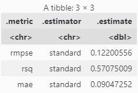

Table 5: Multivariate KNN regression results. The root mean predicted square error (RMPSE) is a measure of how far the predicted values are from the observed values, on average. The R-squared value is a measure of how much variation of the response variable can be explained by the predictor variables. The mean absolute error (MAE) is a measure of the average magnitude of errors.  

An RMPSE value of 0.122 is relatively low, and indicates a well fitted model. However, to better assess the goodness of fit, the residuals should be explored. 

## Residuals Analysis

The RMPSE value is often insufficient alone to determine the efficacy of the model. An additional way to view the model efficacy is by using the residuals. The residual for each observation represents the difference between the actual value and the predicted value, using the formula:  
$e = y - \hat{y}$  
Where $e$ is the residual, $y$ is the actual value, and $\hat{y}$ is the predicted value.  
Assessing the distributions of residuals in normal and fitted plots will provide insight regarding how the goodness of fit for the model varies across the data.

<details>
  <summary>Click to see code</summary>

  ```R
# calculating errors
knn_pred <- knn_prediction %>%
    mutate(residual = energy - .pred)

# calculating 2.5 percentile
p1 <- quantile(knn_pred$residual, .025)

# calculating 97.5 percentile
p2 <- quantile(knn_pred$residual, .975)

# creating residuals histogram
knn_pred_residual_histogram <- knn_pred %>%
    ggplot(aes(x = residual)) +
    geom_histogram(binwidth = 0.025) +
    geom_vline(xintercept = 0, colour = "red") +
    geom_vline(xintercept = p1, colour = "steelblue") +
    geom_vline(xintercept = p2, colour = "steelblue") +
    labs(title = "Distribution of Residuals",
         x = "Residuals",
         y = "Frequency") +
    theme(plot.title = element_text(hjust = 0.5, size = 30),
          text = element_text(size = 20))

# visualizing residuals histogram
options(repr.plot.width = 12, repr.plot.height = 9)
knn_pred_residual_histogram
paste("95% of values lie between (", round(p1, 3), ",", round(p2, 3), ")")
  ```
</details>

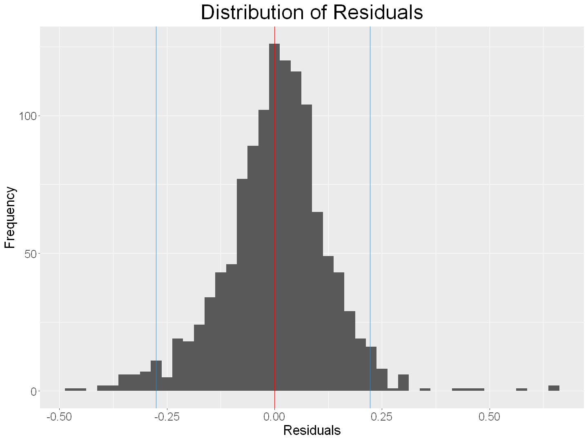

Figure 6: Distribution of Residuals. This plot shows the distribution of residual values in a histogram plot. 95% of values lie between -0.275 and 0.222, shown by the blue lines. The residuals in the histogram are expected to look narrow and symmetrical, centered about 0, which would indicate low error and equally distributed variance with a well fitted model.  

In assessing the current model, the distribution of residuals do indeed look quite narrow, as 95% of values lie between (-0.275, 0.222). While this suggests that the variance is relatively low, the total range is much larger, with heavier tails as there are many outliers towards the ends of the histogram. The distribution centers at 0, which indicates low error. This is expected as the RMPSE value has already suggested low error at 0.122. However, the histogram is slightly assymetrical, being weighted more to the right of the mean. Positive residuals indicate that the actual value is greater than the predicted value, thus suggesting that this model may be underpredicting.  

To assess the normality of the residual distribution, a [quantile-quantile (Q-Q)](https://data.library.virginia.edu/understanding-q-q-plots/) plot can be constructed. A Q-Q plot assesses whether a sample of data follows a Normal distribution by plotting a theoretical Normal distribution with mean of 0 and a standard deviation of 1 along the X axis and graphing this against the variable of interest (in this case residuals). A [“Normal”](https://www.itl.nist.gov/div898/handbook/pmc/section5/pmc51.htm) distribution is understood as one that follows a bell-shaped, unimodal, and symmetric distribution.  

<details>
  <summary>Click to see code</summary>

  ```R
options(repr.plot.width = 12, repr.plot.height = 12)
# adding quantile normalized residuals
qqnorm(knn_pred$residual,
       ylab = "Residual Quantiles",
       xlab = "Theoretical Normal Quantiles")
# adding guideline
qqline(knn_pred$residual, col = "red", lwd = 2)
  ```
</details>

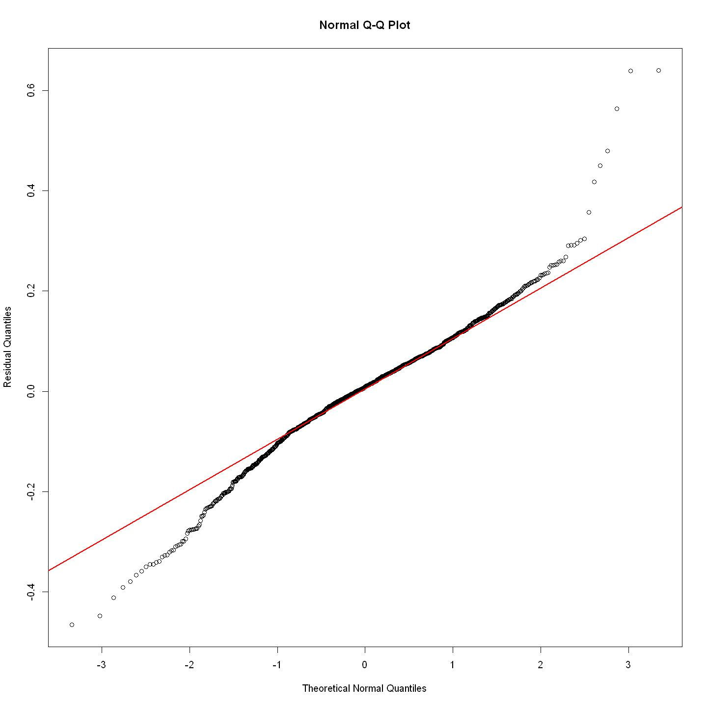

Figure 7: Normal Quantile-Quantile Plot

In this Q-Q plot, the distribution is not a Gaussian distribution because the plotted points do not match the linear line. The two tails of the graph veer-off greatly from this line, qualitatively suggesting that the distribution follows a [leptokurtic](https://www.investopedia.com/terms/l/leptokurtic.asp) distribution that manifests itself as a tall and skinny bell curve that is heavy tailed, which is in concurrence with the shape of the residual distribution in Figure 6. The deviating tails suggest that extreme values or outliers for residuals have a higher occurrence compared to the normal distribution, due to poorer regression.

Although the histogram and Q-Q plots are good visualizations of how the residuals look as a whole, it is unknown how the goodness of fit changes across fitted values. To visualize this, a residuals vs fitted plot can be constructed.

<details>
  <summary>Click to see code</summary>

  ```R
# creating residuals vs fitted plot
knn_pred_residual_fitted <- knn_pred %>%
     ggplot(aes(x = energy, y = residual)) +
     geom_point() +
     geom_hline(yintercept = 0, colour = "red") +
     labs(title = "Residuals vs Fitted",
          x = "Predicted Energy",
          y = "Residuals") +
     scale_x_continuous(breaks = seq(from = 0.0, to = 1.0, by = 0.2)) +
     scale_y_continuous(breaks = seq(from = -0.5, to = 0.5, by = 0.2)) +
     theme(plot.title = element_text(hjust = 0.5, size = 30),
           text = element_text(size = 20))

# visualizing residuals vs fitted plot
options(repr.plot.width = 12, repr.plot.height = 9)
knn_pred_residual_fitted
  ```
</details>

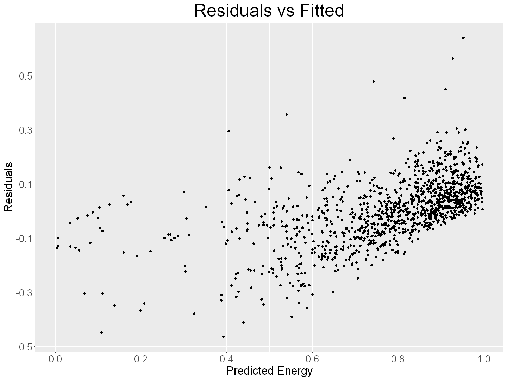

Figure 8: Residuals vs Fitted Plot. This plot shows how the residual values vary across the fitted values. The plot is expected to show homoscedasticity with constant variance and no discernable patterns, which would indicate a well fitted model without overpredicting or underpredicting the data.

The residuals vs fitted plot for the current model shows a less than ideal distribution. The residuals appear heteroscedastic across the fitted values, where there is significantly higher variance between predicted energy values of 0.1-0.7. Furthermore, the model appears to be overpredicting between energy values of 0.0-0.7, and underpredicting above 0.9. Lastly, there are several outliers that appear around the top area of the plot between predicted energy values of 0.4-1.0, which is also seen in the histogram (Figure 6), indicating non-normal error distributions. The diagonal cutoffs at the top left and bottom right portions of the plot can be attributed to the fact that both the model and the actual data share the same range between 0.0-1.0.

## Discussion
  
Overall, it was expected that the energy of house music would increase along with lower acousticness, higher loudness, and higher tempo. This is because energetic music is typically loud and fast, made of synthesized beats. After using the KNN regression model against the testing dataset, the results show a relatively low RMPSE with a narrow residual distribution centered at 0. While this may suggest a well fitted and effective model, the residuals Q-Q plot (Figure 7) accentuates signs of a non-normal distribution, and the residuals vs fitted plot (Figure 8) shows heteroscedasticity. Both of these are undesirable traits, as they are signs of a poorer fitting model. This was somewhat expected, as music is affected by factors apart from measured audio features. Variables such as culture and semantics can significantly impact the feel of music, but are difficult to quantify.

The inaccuracies of the model have some possible explanations. The non-normal tails in the Q-Q plot could be attributed to the dense vertical clustering of data points seen throughout Figures 3.1-3.3, which makes it difficult to accurately predict values in those ranges. As such, there is an increased probability of higher residual values, manifesting as heavy tails in the residual distribution. In addition to this, the residuals vs fitted plot (Figure 8) shows diagonal cutoffs at the top left and bottom right portions of the plot, as the testing data and prediction data share the same range. Due to this, the model cannot underpredict at the left boundary nor overpredict at the right boundary, consequently making the RMPSE appear quite low. This is slightly misleading as the residuals in fact have undesirable variance distributions.

Despite these limitations and inaccuracies, this predictive model can be generalized to help recommend songs with high energy to consumers within the house music genre, although predictions should be taken with caution. In analyzing the data, the variables with stronger correlations to energy may help provide a framework in predicting ratings of other genres as well. Additionally, finding these insights between audio metrics is useful for artists and [emerging music creation AIs](https://www.frontiersin.org/articles/10.3389/frobt.2021.647028/full) for construction of more songs within the house music genre. These findings could also lead to further exploration of audio metrics in a more abstract scope, such as researching the energy levels and correlations in other genres, and how they compare to house music.

## References

https://www.google.com/url?q=https://newsroom.spotify.com/company-info/&sa=D&source=docs&ust=1646548657733947&usg=AOvVaw2-aNiFTZDrkhXIWRxPE4aU  
  
https://dl.acm.org/doi/10.1145/2959100.2959120  
  
https://www.allmusic.com/subgenre/house-ma0000002651?1646545415388&fbclid=IwAR2ZKQ2EAzLFX4E4FsCyNbLL17Y2Jrjmtqz0tW7dsIwkIn40YQT2QV1hYH8  
  
https://developer.spotify.com/documentation/web-api/reference/#/operations/get-several-audio-features
  
https://link.springer.com/chapter/10.1007/978-0-585-25657-3_37?fbclid=IwAR2u0Vn5r5yuJu6xJ0Pf7pKe3lHKhDeiLuY-3SnAUnkXkBjzuhZju9PLvtY

https://www.ncbi.nlm.nih.gov/pmc/articles/PMC5969114/?fbclid=IwAR2iKztbQH8JVUawh7m36ixXiBHFssk7oljTA5-63IGcvA_OGnGKHOCrcmQ

https://data.library.virginia.edu/understanding-q-q-plots/

https://www.itl.nist.gov/div898/handbook/pmc/section5/pmc51.htm

https://www.investopedia.com/terms/l/leptokurtic.asp

https://www.frontiersin.org/articles/10.3389/frobt.2021.647028/full
